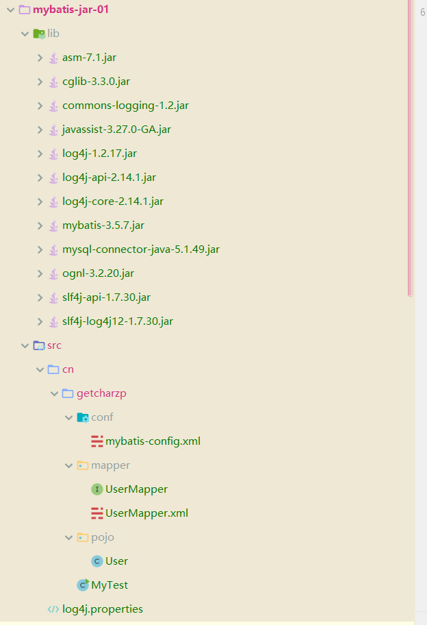
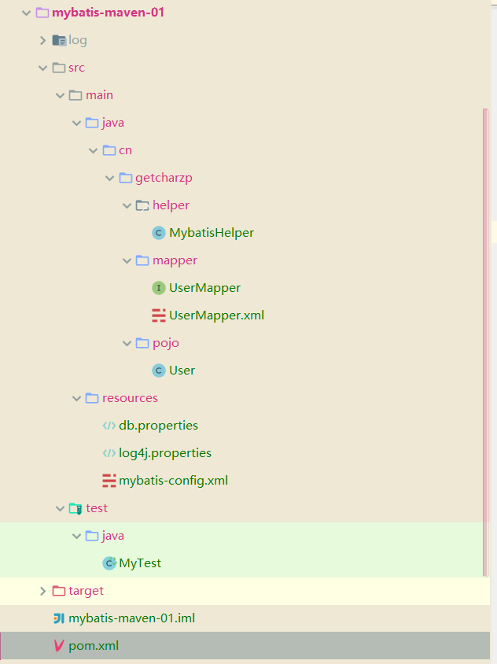
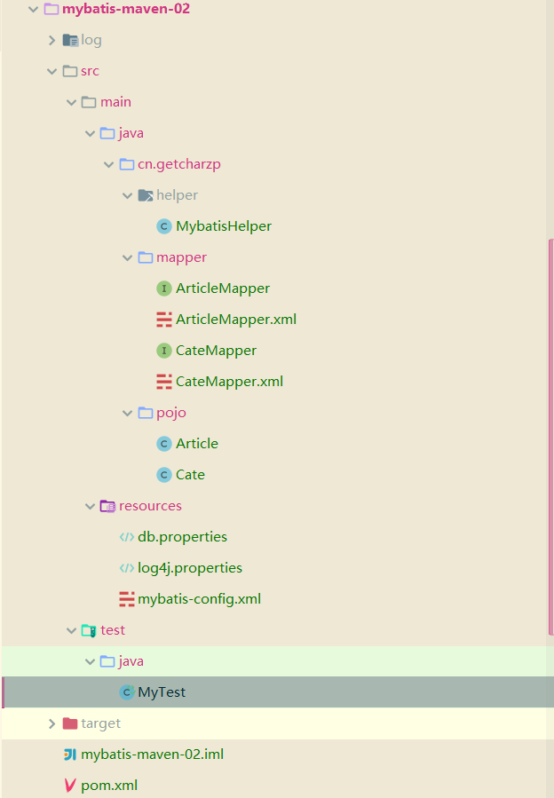

# MyBatis3

> MyBatis 是一款优秀的持久层框架，它支持自定义 SQL、存储过程以及高级映射。MyBatis 免除了几乎所有的 JDBC 代码以及设置参数和获取结果集的工作。MyBatis 可以通过简单的 XML 或注解来配置和映射原始类型、接口和 Java POJO（Plain Old Java Objects，普通老式 Java 对象）为数据库中的记录。
>
> mybatis官网：https://mybatis.org/mybatis-3/zh/index.html
>
> 
>
> java环境：java 11.0.11 2021-04-20 LTS
>
> mysql 版本：5.7.26
>
> mybatis版本：[mybatis-3.5.7](https://github.com/mybatis/mybatis-3/releases/tag/mybatis-3.5.7)
>
> jdbc驱动：[mysql-connector-java-5.1.49](https://downloads.mysql.com/archives/get/p/3/file/mysql-connector-java-5.1.49.tar.gz)

## Mybatis安装

1、下载原生jar包进行使用

> 下载地址： https://github.com/mybatis/mybatis-3/releases

将下载的mybatis相关的jar包以及jdbc相关的jar包导入到src目录下新增的lib目录下，在idea中选中这些jar包点击`Add As Libraries `，目录结构如下所示



mybatis-config.xml

```xml
<?xml version="1.0" encoding="UTF-8" ?>
<!DOCTYPE configuration
  PUBLIC "-//mybatis.org//DTD Config 3.0//EN"
  "http://mybatis.org/dtd/mybatis-3-config.dtd">
<configuration>
  <environments default="development">
    <environment id="development">
      <transactionManager type="JDBC"/>
      <dataSource type="POOLED">
        <property name="driver" value="com.mysql.jdbc.Driver"/>
            <property name="url" value="jdbc:mysql://localhost:3306/mybatis?useUnicode=true&amp;characterEncoding=UTF8&amp;useSSL=false"/>
        <property name="username" value="root"/>
        <property name="password" value="root"/>
      </dataSource>
    </environment>
  </environments>
  <mappers>
    <mapper resource="org/mybatis/example/BlogMapper.xml"/>
  </mappers>
</configuration>
```

UserMapper.java

```java
package cn.getcharzp.mapper;

import cn.getcharzp.pojo.User;

import java.util.List;

public interface UserMapper {
    List<User> selectUser();
}
```

UserMapper.xml

```xml
<?xml version="1.0" encoding="UTF-8" ?>
<!DOCTYPE mapper
        PUBLIC "-//mybatis.org//DTD Mapper 3.0//EN"
        "http://mybatis.org/dtd/mybatis-3-mapper.dtd">
<mapper namespace="cn.getcharzp.mapper.UserMapper">
    <select id="selectUser" resultType="cn.getcharzp.pojo.User">
        select * from user
  </select>
</mapper>
```

User.java

```java
package cn.getcharzp.pojo;

public class User {
    private Integer id;
    private String name;
    private String password;

    public Integer getId() {
        return id;
    }

    public void setId(Integer id) {
        this.id = id;
    }

    public String getName() {
        return name;
    }

    public void setName(String name) {
        this.name = name;
    }

    public String getPassword() {
        return password;
    }

    public void setPassword(String password) {
        this.password = password;
    }

    @Override
    public String toString() {
        return "User{" +
                "id=" + id +
                ", name='" + name + '\'' +
                ", password='" + password + '\'' +
                '}';
    }
}
```

log4j.properties

```properties
#将等级为DEBUG的日志信息输出到console和file这两个目的地，console和file的定义在下面的代码
log4j.rootLogger=DEBUG,console,file

#控制台输出的相关设置
log4j.appender.console = org.apache.log4j.ConsoleAppender
log4j.appender.console.Target = System.out
log4j.appender.console.Threshold=DEBUG
log4j.appender.console.layout = org.apache.log4j.PatternLayout
log4j.appender.console.layout.ConversionPattern=[%c]-%m%n

#文件输出的相关设置
log4j.appender.file = org.apache.log4j.RollingFileAppender
log4j.appender.file.File=./log/zhao.log
log4j.appender.file.MaxFileSize=10mb
log4j.appender.file.Threshold=DEBUG
log4j.appender.file.layout=org.apache.log4j.PatternLayout
log4j.appender.file.layout.ConversionPattern=[%p][%d{yyyy-MM-dd HH:mm:ss}][%c]%m%n

#日志输出级别
log4j.logger.org.mybatis=DEBUG
log4j.logger.java.sql=DEBUG
log4j.logger.java.sql.Statement=DEBUG
log4j.logger.java.sql.ResultSet=DEBUG
log4j.logger.java.sql.PreparedStatement=DEBUG
```

MyTest.java 运行该文件能正常查询user表中的数据

```java
package cn.getcharzp;

import cn.getcharzp.mapper.UserMapper;
import cn.getcharzp.pojo.User;
import org.apache.ibatis.io.Resources;
import org.apache.ibatis.session.SqlSession;
import org.apache.ibatis.session.SqlSessionFactory;
import org.apache.ibatis.session.SqlSessionFactoryBuilder;
import org.apache.log4j.Logger;

import java.io.IOException;
import java.io.InputStream;
import java.util.List;

public class MyTest {
    public static void main(String[] args) {
        try {
            InputStream inputStream = Resources.getResourceAsStream("cn/getcharzp/conf/mybatis-config.xml");
            SqlSessionFactory sqlSessionFactory = new SqlSessionFactoryBuilder().build(inputStream);
            SqlSession sqlSession = sqlSessionFactory.openSession();
            UserMapper userMapper = sqlSession.getMapper(UserMapper.class);
            List<User> users = userMapper.selectUser();
            for (User user : users) {
                System.out.println(user);
            }
        } catch (IOException e) {
            e.printStackTrace();
        }
    }
}
```

2、使用`maven`管理jar包

单表查询 Demo :

目录结构如下：



MybatisHelper.java 用于获取SqlSession

```java
package cn.getcharzp.helper;

import org.apache.ibatis.io.Resources;
import org.apache.ibatis.session.SqlSession;
import org.apache.ibatis.session.SqlSessionFactory;
import org.apache.ibatis.session.SqlSessionFactoryBuilder;

import java.io.IOException;
import java.io.InputStream;

public class MybatisHelper {
    public static SqlSession getSqlSession(){
        String resource = "mybatis-config.xml";
        InputStream inputStream = null;
        try {
            inputStream = Resources.getResourceAsStream(resource);
        } catch (IOException e) {
            e.printStackTrace();
        }
        SqlSessionFactory sqlSessionFactory = new SqlSessionFactoryBuilder().build(inputStream);
        return sqlSessionFactory.openSession();
    }
}
```

UserMapper.java 定义User的CRUD接口

```java
package cn.getcharzp.mapper;

import cn.getcharzp.pojo.User;

import java.util.List;
import java.util.Map;

public interface UserMapper {
    List<User> selectUser();

    List<User> selectByName(Map map);

    int insertUser(User user);

    int updateUser(User user);

    int deleteUser(int id);
}
```

UserMapper.xml针对UserMapper.java接口的具体SQL语句

```xml
<?xml version="1.0" encoding="UTF-8" ?>
<!DOCTYPE mapper
        PUBLIC "-//mybatis.org//DTD Mapper 3.0//EN"
        "http://mybatis.org/dtd/mybatis-3-mapper.dtd">
<mapper namespace="cn.getcharzp.mapper.UserMapper">
    <select id="selectUser" resultType="User">
    select * from user
  </select>

    <select id="selectByName" resultType="User">
        select * from user where name like #{name}
    </select>

    <insert id="insertUser" >
        insert into user (`id`, `name`, `password`) VALUES (#{id}, #{name}, #{password})
    </insert>

    <update id="updateUser" >
        update user set name=#{name}, password=#{password} where id = #{id}
    </update>

    <delete id="deleteUser" >
        delete from user where id = #{id}
    </delete>
</mapper>
```

User.java

```java
package cn.getcharzp.pojo;

import lombok.AllArgsConstructor;
import lombok.Data;

@Data
@AllArgsConstructor
public class User {
    private Integer id;
    private String name;
    private String password;
}
```

db.properties

```properties
driver=com.mysql.jdbc.Driver
url=jdbc:mysql://localhost:3306/mybatis?useUnicode=true&characterEncoding=UTF8&useSSL=false
username=root
password=root
```

log4j.properties 的配置文件同上

mybatis-config.xml

```xml
<?xml version="1.0" encoding="UTF-8" ?>
<!DOCTYPE configuration
        PUBLIC "-//mybatis.org//DTD Config 3.0//EN"
        "http://mybatis.org/dtd/mybatis-3-config.dtd">
<configuration>
    <properties resource="db.properties" />
    <settings>
        <setting name="logImpl" value="LOG4J"/>
    </settings>
    <typeAliases>
        <typeAlias alias="User" type="cn.getcharzp.pojo.User"/>
    </typeAliases>
    <environments default="development">
        <environment id="development">
            <transactionManager type="JDBC"/>
            <dataSource type="POOLED">
                <property name="driver" value="${driver}"/>
                <property name="url" value="${url}"/>
                <property name="username" value="${username}"/>
                <property name="password" value="${password}"/>
            </dataSource>
        </environment>
    </environments>
    <mappers>
        <!--<mapper resource="cn/getcharzp/mapper/UserMapper.xml"/>-->
        <package name="cn.getcharzp.mapper" />
    </mappers>
</configuration>
```

MyTest.java

```java
import cn.getcharzp.helper.MybatisHelper;
import cn.getcharzp.mapper.UserMapper;
import cn.getcharzp.pojo.User;
import org.apache.ibatis.session.SqlSession;
import org.junit.Test;

import java.util.HashMap;
import java.util.List;

public class MyTest {
    @Test
    public void T() {
        SqlSession sqlSession = MybatisHelper.getSqlSession();
        UserMapper mapper = sqlSession.getMapper(UserMapper.class);
        List<User> users = mapper.selectUser();
        for (User user : users) {
            System.out.println(user);
        }
    }

    @Test
    public void selectByName() {
        SqlSession sqlSession = MybatisHelper.getSqlSession();
        UserMapper mapper = sqlSession.getMapper(UserMapper.class);
        HashMap<String, Object> map = new HashMap<String, Object>();
        map.put("name", "%22%");
        List<User> users = mapper.selectByName(map);
        for (User user : users) {
            System.out.println(user);
        }
        sqlSession.close();
    }

    @Test
    public void insert() {
        SqlSession sqlSession = MybatisHelper.getSqlSession();
        UserMapper mapper = sqlSession.getMapper(UserMapper.class);
        int i = mapper.insertUser(new User(0, "Username", "Password"));
        System.out.println(i);
        sqlSession.close();
    }

    @Test
    public void update() {
        SqlSession sqlSession = MybatisHelper.getSqlSession();
        UserMapper mapper = sqlSession.getMapper(UserMapper.class);
        int i = mapper.updateUser(new User(5, "Username1", "Password1"));
        System.out.println(i);
        sqlSession.close();
    }

    @Test
    public void delete() {
        SqlSession sqlSession = MybatisHelper.getSqlSession();
        UserMapper mapper = sqlSession.getMapper(UserMapper.class);
        int i = mapper.deleteUser(6);
        System.out.println(i);
        sqlSession.close();
    }
}
```

pom.xml

```xml
<?xml version="1.0" encoding="UTF-8"?>
<project xmlns="http://maven.apache.org/POM/4.0.0"
         xmlns:xsi="http://www.w3.org/2001/XMLSchema-instance"
         xsi:schemaLocation="http://maven.apache.org/POM/4.0.0 http://maven.apache.org/xsd/maven-4.0.0.xsd">
    <modelVersion>4.0.0</modelVersion>

    <groupId>cn.getcharzp</groupId>
    <artifactId>mybatis-maven-01</artifactId>
    <version>1.0-SNAPSHOT</version>

    <build>
        <resources>
            <resource>
                <directory>src/main/java</directory>
                <includes>
                    <include>**/*.properties</include>
                    <include>**/*.xml</include>
                </includes>
                <filtering>true</filtering>
            </resource>
            <resource>
                <directory>src/main/resources</directory>
                <includes>
                    <include>**/*.properties</include>
                    <include>**/*.xml</include>
                </includes>
                <filtering>true</filtering>
            </resource>
        </resources>
    </build>
    <dependencies>
        <dependency>
            <groupId>org.mybatis</groupId>
            <artifactId>mybatis</artifactId>
            <version>3.5.7</version>
        </dependency>
        <dependency>
            <groupId>junit</groupId>
            <artifactId>junit</artifactId>
            <version>4.13.2</version>
            <scope>test</scope>
        </dependency>
        <dependency>
            <groupId>mysql</groupId>
            <artifactId>mysql-connector-java</artifactId>
            <version>5.1.47</version>
        </dependency>
        <dependency>
            <groupId>log4j</groupId>
            <artifactId>log4j</artifactId>
            <version>1.2.17</version>
        </dependency>
        <dependency>
            <groupId>org.projectlombok</groupId>
            <artifactId>lombok</artifactId>
            <version>1.18.20</version>
            <scope>provided</scope>
        </dependency>
    </dependencies>
</project>
```

多表查询 Demo :



MybatisHelper.java 同上

ArticleMapper.java

```java
package cn.getcharzp.mapper;

import cn.getcharzp.pojo.Article;

import java.util.List;

public interface ArticleMapper {
    List<Article> getArticles();
}
```

ArticleMapper.xml

```xml
<?xml version="1.0" encoding="UTF-8" ?>
<!DOCTYPE mapper
        PUBLIC "-//mybatis.org//DTD Mapper 3.0//EN"
        "http://mybatis.org/dtd/mybatis-3-mapper.dtd">
<mapper namespace="cn.getcharzp.mapper.ArticleMapper">
    <resultMap id="MyArticle" type="Article">
        <result column="aid" property="id"/>
        <result column="title" property="title" />
        <result column="cid" property="cate.id" />
        <result column="cname" property="cate.name" />
    </resultMap>
    <select id="getArticles" resultMap="MyArticle">
        select a.id aid, a.title title, c.id cid, c.name cname from article a, cate c where a.cid = c.id
    </select>

</mapper>
```

CateMapper.java

```java
package cn.getcharzp.mapper;

import cn.getcharzp.pojo.Cate;

import java.util.List;

public interface CateMapper {
    List<Cate> getCates();
}
```

CateMapper.xml

```xml
<?xml version="1.0" encoding="UTF-8" ?>
<!DOCTYPE mapper
        PUBLIC "-//mybatis.org//DTD Mapper 3.0//EN"
        "http://mybatis.org/dtd/mybatis-3-mapper.dtd">
<mapper namespace="cn.getcharzp.mapper.CateMapper">
<resultMap id="MyCate" type="Cate">
    <result property="id" column="cid" />
    <result property="name" column="cname" />
    <collection property="articles" ofType="Article">
        <result property="id" column="aid"/>
        <result property="title" column="title" />
    </collection>
</resultMap>
<select id="getCates" resultMap="MyCate">
    select a.id aid, a.title title, c.id cid, c.name cname from article a, cate c where a.cid = c.id
</select>

</mapper>
```

Article.java

```java
package cn.getcharzp.pojo;

import lombok.Data;

import java.util.List;

@Data
public class Article {
    private Integer id;
    private String title;
    private Cate cate;
}
```

Cate.java

```java
package cn.getcharzp.pojo;

import lombok.Data;

import java.util.List;

@Data
public class Cate {
    private Integer id;
    private String name;
    private List<Article> articles;
}
```

db.properties 同上

log4j.properties 同上

mybatis-config.xml

```xml
<?xml version="1.0" encoding="UTF-8" ?>
<!DOCTYPE configuration
        PUBLIC "-//mybatis.org//DTD Config 3.0//EN"
        "http://mybatis.org/dtd/mybatis-3-config.dtd">
<configuration>
    <properties resource="db.properties" />
    <settings>
        <setting name="logImpl" value="LOG4J"/>
    </settings>
    <typeAliases>
        <package name="cn.getcharzp.pojo" />
    </typeAliases>
    <environments default="development">
        <environment id="development">
            <transactionManager type="JDBC"/>
            <dataSource type="POOLED">
                <property name="driver" value="${driver}"/>
                <property name="url" value="${url}"/>
                <property name="username" value="${username}"/>
                <property name="password" value="${password}"/>
            </dataSource>
        </environment>
    </environments>
    <mappers>
        <!--<mapper resource="cn/getcharzp/mapper/UserMapper.xml"/>-->
        <package name="cn.getcharzp.mapper" />
    </mappers>
</configuration>
```

MyTest.java

```java
import cn.getcharzp.helper.MybatisHelper;
import cn.getcharzp.mapper.ArticleMapper;
import cn.getcharzp.mapper.CateMapper;
import cn.getcharzp.pojo.Article;
import cn.getcharzp.pojo.Cate;
import org.apache.ibatis.session.SqlSession;
import org.junit.Test;

import java.util.List;

public class MyTest {
    @Test
    public void getArticles() {
        SqlSession sqlSession = MybatisHelper.getSqlSession();
        ArticleMapper mapper = sqlSession.getMapper(ArticleMapper.class);
        List<Article> articles = mapper.getArticles();
        for (Article article : articles) {
            System.out.println(article);
        }
        sqlSession.close();
    }

    @Test
    public void getCates() {
        SqlSession sqlSession = MybatisHelper.getSqlSession();
        CateMapper mapper = sqlSession.getMapper(CateMapper.class);
        List<Cate> cates = mapper.getCates();
        for (Cate cate : cates) {
            System.out.println(cate);
        }
        sqlSession.close();
    }
}
```

pom.xml

```xml
<?xml version="1.0" encoding="UTF-8"?>
<project xmlns="http://maven.apache.org/POM/4.0.0"
         xmlns:xsi="http://www.w3.org/2001/XMLSchema-instance"
         xsi:schemaLocation="http://maven.apache.org/POM/4.0.0 http://maven.apache.org/xsd/maven-4.0.0.xsd">
    <modelVersion>4.0.0</modelVersion>

    <groupId>cn.getcharzp</groupId>
    <artifactId>mybatis-maven-02</artifactId>
    <version>1.0-SNAPSHOT</version>
    <build>
        <resources>
            <resource>
                <directory>src/main/java</directory>
                <includes>
                    <include>**/*.properties</include>
                    <include>**/*.xml</include>
                </includes>
                <filtering>true</filtering>
            </resource>
            <resource>
                <directory>src/main/resources</directory>
                <includes>
                    <include>**/*.properties</include>
                    <include>**/*.xml</include>
                </includes>
                <filtering>true</filtering>
            </resource>
        </resources>
    </build>
    <dependencies>
        <dependency>
            <groupId>org.mybatis</groupId>
            <artifactId>mybatis</artifactId>
            <version>3.5.7</version>
        </dependency>
        <dependency>
            <groupId>junit</groupId>
            <artifactId>junit</artifactId>
            <version>4.13.2</version>
            <scope>test</scope>
        </dependency>
        <dependency>
            <groupId>mysql</groupId>
            <artifactId>mysql-connector-java</artifactId>
            <version>5.1.47</version>
        </dependency>
        <dependency>
            <groupId>log4j</groupId>
            <artifactId>log4j</artifactId>
            <version>1.2.17</version>
        </dependency>
        <dependency>
            <groupId>org.projectlombok</groupId>
            <artifactId>lombok</artifactId>
            <version>1.18.20</version>
            <scope>provided</scope>
        </dependency>
    </dependencies>

</project>
```

3、使用`gradle`管理jar包

gradle 项目配置阿里云下载镜像 ：https://developer.aliyun.com/mvn/guide

在 build.gradle 文件中加入以下代码：

```gradle
allprojects {
  repositories {
    maven {
      url 'https://maven.aliyun.com/repository/public/'
    }
    mavenLocal()
    mavenCentral()
  }
}
```

build.gradle

```gradle
plugins {
    id 'java'
}

group 'cn.getcharzp'
version '1.0-SNAPSHOT'

sourceCompatibility = 1.8

repositories {
    maven {
        url 'https://maven.aliyun.com/repository/public/'
    }
    mavenLocal()
    mavenCentral()
}
dependencies {
    testCompile group: 'junit', name: 'junit', version: '4.12'
    implementation 'org.mybatis:mybatis:3.5.7'
    // https://mvnrepository.com/artifact/log4j/log4j
    implementation 'log4j:log4j:1.2.17'
    // https://mvnrepository.com/artifact/mysql/mysql-connector-java
    implementation 'mysql:mysql-connector-java:5.1.47'
}
```
